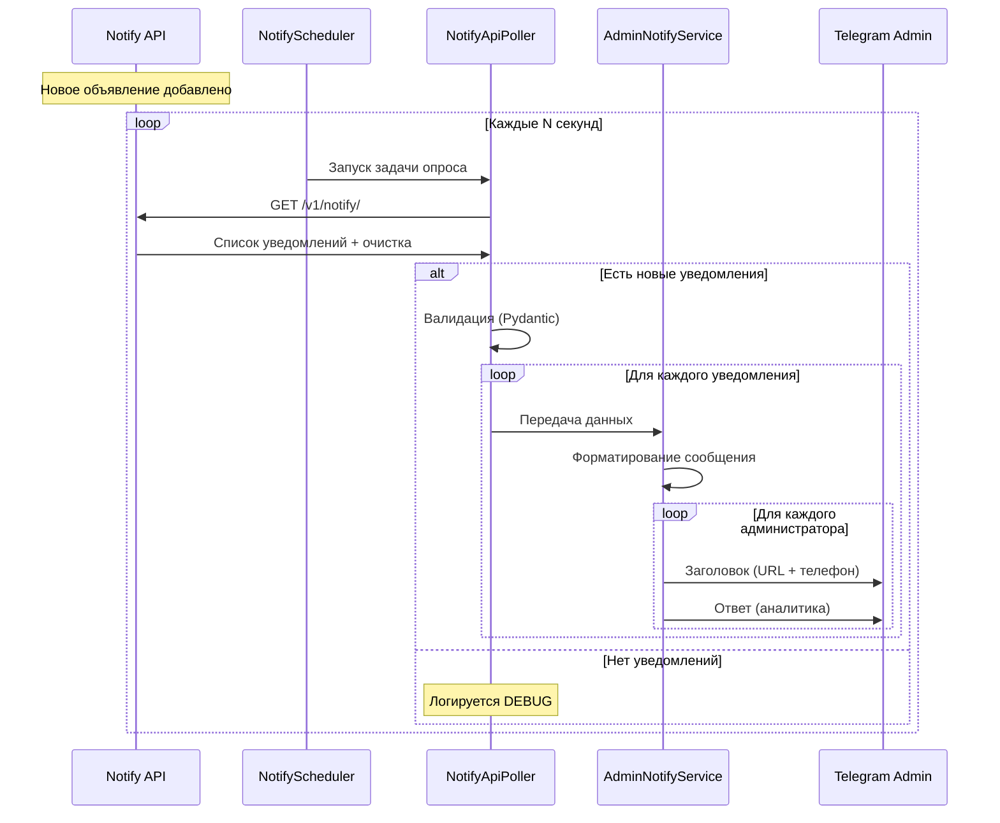

# 🚗 New Car Sell Notify Bot

[](https://www.python.org/downloads/)
[](https://docs.aiogram.dev/)
[](https://www.docker.com/)
[](LICENSE)

Telegram-бот для автоматического уведомления администраторов о новых объявлениях продажи автомобилей. Бот периодически опрашивает внешний API сервиса уведомлений и отправляет информацию о новых объявлениях администраторам через Telegram.

## 📋 Содержание

- [Описание](#-описание)
- [Архитектура](#-архитектура)
- [Бизнес-логика](#-бизнес-логика)
- [Функциональные возможности](#-функциональные-возможности)
- [Технологический стек](#-технологический-стек)
- [Установка и запуск](#-установка-и-запуск)
- [Конфигурация](#-конфигурация)
- [Структура проекта](#-структура-проекта)
- [Модули и компоненты](#-модули-и-компоненты)
- [Тестирование](#-тестирование)
- [Docker](#-docker)
- [Разработка](#-разработка)
- [FAQ](#-faq)

---

## 🎯 Описание

**New Car Sell Notify Bot** — это автоматизированная система уведомлений для мониторинга рынка автомобилей. Бот работает в связке с внешним API сервисом, который анализирует объявления о продаже автомобилей, и доставляет актуальные уведомления администраторам в режиме реального времени через Telegram.

### Основная задача

Бот решает проблему своевременного информирования о новых предложениях на рынке автомобилей, обеспечивая:
- ⚡ Быструю доставку информации о новых объявлениях
- 🤖 Автоматический мониторинг без участия человека
- 📊 Структурированную аналитику по каждому объявлению
- 📱 Удобный формат уведомлений в Telegram

---

## 🏗️ Архитектура

Проект построен на основе микросервисной архитектуры с четким разделением ответственности:

```
┌─────────────────────────────────────────────────────────────┐
│                    External Services                         │
│  ┌─────────────────────┐      ┌──────────────────────┐     │
│  │  Notify API Service │      │   Telegram Bot API   │     │
│  │   (Redis + FastAPI) │      │                      │     │
│  └──────────┬──────────┘      └──────────▲───────────┘     │
└─────────────┼────────────────────────────┼──────────────────┘
              │                            │
              │ HTTP/REST                  │ Bot API
              │                            │
┌─────────────▼────────────────────────────┼──────────────────┐
│           New Car Sell Notify Bot        │                  │
│  ┌────────────────────────────────────────────────────┐    │
│  │              Main Application                       │    │
│  │  ┌──────────────────────────────────────────────┐  │    │
│  │  │         NotifyScheduler (APScheduler)        │  │    │
│  │  │  • Периодический опрос (1 сек по умолчанию) │  │    │
│  │  │  • Управление жизненным циклом               │  │    │
│  │  └───────────────────┬──────────────────────────┘  │    │
│  │                      │                              │    │
│  │  ┌───────────────────▼──────────────────────────┐  │    │
│  │  │        NotifyApiPoller (Client)              │  │    │
│  │  │  • HTTP запросы к API                        │  │    │
│  │  │  • Валидация данных (Pydantic)               │  │    │
│  │  └───────────────────┬──────────────────────────┘  │    │
│  │                      │                              │    │
│  │  ┌───────────────────▼──────────────────────────┐  │    │
│  │  │      AdminNotifyService (Sender)             │  │────┤
│  │  │  • Форматирование сообщений                  │  │    │
│  │  │  • Отправка в Telegram                       │  │    │
│  │  │  • Обработка ошибок                          │  │    │
│  │  └──────────────────────────────────────────────┘  │    │
│  └────────────────────────────────────────────────────┘    │
└──────────────────────────────────────────────────────────────┘
```

### Поток данных

1. **Внешний сервис** анализирует объявления и добавляет их в API
2. **NotifyScheduler** запускает задачу каждую N секунд
3. **NotifyApiPoller** делает HTTP GET запрос к API
4. API возвращает список новых уведомлений и **очищает** их из хранилища
5. **NotifyApiPoller** валидирует данные через Pydantic модели
6. **AdminNotifyService** отправляет уведомления каждому администратору
7. Администраторы получают сообщения в Telegram

---

## 💼 Бизнес-логика

### Жизненный цикл уведомления



### Ключевые особенности

#### 1. Атомарность операций
- API использует распределенную блокировку Redis для безопасного добавления/получения
- GET запрос **деструктивен** — после получения уведомления удаляются из очереди
- Это предотвращает дублирование уведомлений

#### 2. Обработка ошибок
- Ошибки для каждого администратора обрабатываются независимо
- Сбой отправки одному админу не блокирует отправку остальным
- Все ошибки логируются с полным traceback

#### 3. Форматирование сообщений
- Каждое уведомление состоит из **двух сообщений**:
  - **Заголовок**: ссылка на объявление + телефон продавца
  - **Ответ на заголовок**: подробная аналитика (до 4096 символов)
- Телефон очищается от префикса `tel:` для читаемости
- HTML форматирование для красивого отображения

#### 4. Масштабируемость
- Singleton паттерн для планировщика
- Асинхронная архитектура (asyncio)
- Пул соединений aiohttp
- Контекстные менеджеры для управления ресурсами

---

## ✨ Функциональные возможности

### Основные функции

- ✅ **Автоматический мониторинг** — периодический опрос API с настраиваемым интервалом
- ✅ **Множественные администраторы** — поддержка неограниченного количества получателей
- ✅ **Валидация данных** — строгая проверка через Pydantic (URL, телефоны в E.164)
- ✅ **HTML форматирование** — красивые сообщения с эмодзи и разметкой
- ✅ **Graceful shutdown** — корректное завершение всех процессов
- ✅ **Подробное логирование** — вся активность записывается в логи
- ✅ **Hot reload** — автоперезагрузка при изменении кода (dev режим)
- ✅ **Docker support** — готовые образы для production deployment

### Дополнительные возможности

- 🔧 **Настраиваемый интервал** — от 1 секунды до любого значения
- 🔧 **Конфигурация через .env** — простая настройка без изменения кода
- 🔧 **Тестовые утилиты** — набор скриптов для проверки работоспособности
- 🔧 **Раздельные окружения** — development / production режимы

---

## 🛠️ Технологический стек

### Основные технологии

| Технология | Версия | Назначение |
|------------|--------|------------|
| **Python** | 3.12+ | Основной язык программирования |
| **aiogram** | 3.22.0 | Фреймворк для Telegram Bot API |
| **aiohttp** | 3.12.15 | Асинхронный HTTP клиент |
| **APScheduler** | 3.11.1 | Планировщик задач |
| **Pydantic** | 2.11.10 | Валидация данных и настроек |
| **Docker** | latest | Контейнеризация |

### Вспомогательные библиотеки

- **pydantic-settings** — управление конфигурацией из .env
- **pydantic-extra-types** — валидация телефонных номеров (E.164)
- **python-dotenv** — загрузка переменных окружения
- **hupper** — hot reload для разработки
- **phonenumbers** — парсинг и валидация телефонов

---

## 🚀 Установка и запуск

### Предварительные требования

- Python 3.12 или выше
- Telegram Bot Token (получить у [@BotFather](https://t.me/BotFather))
- Доступ к Notify API (должен быть запущен и доступен)

### Быстрый старт

#### 1. Клонирование репозитория

```bash
git clone https://github.com/your-org/new_car_sell_notify_bot.git
cd new_car_sell_notify_bot
```

#### 2. Создание виртуального окружения

```bash
# Создание окружения
python -m venv venv

# Активация (Linux/macOS)
source venv/bin/activate

# Активация (Windows)
venv\Scripts\activate
```

#### 3. Установка зависимостей

```bash
pip install -r requirements.txt
```

#### 4. Настройка конфигурации

Создайте файл `.env` в корне проекта:

```env
# Telegram Bot
BOT_TOKEN=1234567890:ABCdefGHIjklMNOpqrsTUVwxyz
ADMINS_TG_IDS=123456789,987654321

# Notify API
NOTIFY_API_HOST=localhost
NOTIFY_API_PORT=8000

# Environment
ENV=development
```

#### 5. Запуск бота

**Production режим:**
```bash
python main.py
```

**Development режим (с hot reload):**
```bash
python hupper_main.py
```

### Проверка работоспособности

1. Запустите API сервис уведомлений
2. Добавьте тестовые уведомления:
   ```bash
   python -m tests.test_add_notifies
   ```
3. Проверьте Telegram — администраторы должны получить сообщения

---

## ⚙️ Конфигурация

### Переменные окружения

Все настройки проекта хранятся в файле `.env`:

| Переменная | Обязательна | По умолчанию | Описание |
|------------|-------------|--------------|----------|
| `BOT_TOKEN` | ✅ Да | - | Токен Telegram бота от @BotFather |
| `ADMINS_TG_IDS` | ✅ Да | - | Список Telegram ID админов через запятую |
| `NOTIFY_API_HOST` | ❌ Нет | `localhost` | Хост API сервиса уведомлений |
| `NOTIFY_API_PORT` | ❌ Нет | `8000` | Порт API сервиса |
| `ENV` | ❌ Нет | `development` | Окружение: `development` или `production` |

### Примеры конфигурации

**Локальная разработка:**
```env
BOT_TOKEN=your_bot_token_here
ADMINS_TG_IDS=123456789
NOTIFY_API_HOST=localhost
NOTIFY_API_PORT=8000
ENV=development
```

**Docker окружение:**
```env
BOT_TOKEN=your_bot_token_here
ADMINS_TG_IDS=123456789,987654321
NOTIFY_API_HOST=host.docker.internal
NOTIFY_API_PORT=8000
ENV=production
```

**Production (API в отдельном контейнере):**
```env
BOT_TOKEN=your_bot_token_here
ADMINS_TG_IDS=123456789,987654321,555666777
NOTIFY_API_HOST=new_car_sell_notify_service_api
NOTIFY_API_PORT=8000
ENV=production
```

### Настройка интервала опроса

Интервал опроса настраивается в коде (`main.py`):

```python
# Опрос каждую секунду (по умолчанию)
self.scheduler = get_notify_scheduler(self.bot, interval_seconds=1)

# Опрос каждые 5 секунд
self.scheduler = get_notify_scheduler(self.bot, interval_seconds=5)

# Опрос каждые 30 секунд
self.scheduler = get_notify_scheduler(self.bot, interval_seconds=30)
```

---

## 📁 Структура проекта

```
new_car_sell_notify_bot/
├── 📄 main.py                          # Точка входа (production)
├── 📄 hupper_main.py                   # Точка входа (development с hot reload)
├── 📄 requirements.txt                 # Python зависимости
├── 📄 pyproject.toml                   # Метаданные проекта
├── 📄 .env                             # Конфигурация (не в git)
├── 📄 .gitignore                       # Игнорируемые файлы
│
├── 🐳 Dockerfile                       # Docker образ
├── 🐳 docker-compose.yml               # Docker оркестрация
├── 📖 DOCKER.md                        # Docker документация
├── 📖 NOTIFY_API_DOCS.md               # API документация
├── 📖 README.md                        # Этот файл
│
├── 📦 app/                             # Основной пакет приложения
│   ├── __init__.py
│   │
│   ├── 📁 config/                      # Конфигурация
│   │   ├── __init__.py
│   │   └── config_reader.py            # Чтение .env (Pydantic Settings)
│   │
│   ├── 📁 modules/                     # Бизнес-логика
│   │   ├── __init__.py
│   │   │
│   │   └── 📁 notify/                  # Модуль уведомлений
│   │       ├── __init__.py
│   │       ├── notify_api_client.py    # HTTP клиент для API
│   │       ├── notify_api_poller.py    # Логика опроса API
│   │       ├── notify_api_poller_test.py # Тестовый поллер
│   │       ├── notify_scheduler.py     # APScheduler планировщик
│   │       ├── admin_notify.py         # Отправка уведомлений админам
│   │       └── README.md               # Документация модуля
│   │
│   ├── 📁 schemas/                     # Pydantic модели
│   │   ├── __init__.py
│   │   └── notify.py                   # Модели уведомлений
│   │
│   └── 📁 utils/                       # Утилиты
│       ├── __init__.py
│       │
│       └── 📁 aiohttp_client/          # Универсальный HTTP клиент
│           ├── __init__.py
│           ├── aiohttp_client.py       # Реализация клиента
│           └── README.MD               # Документация клиента
│
└── 📁 tests/                           # Тестовые скрипты
    ├── README.md
    ├── test_add_notifies.py            # Добавление тестовых уведомлений
    ├── test_poller.py                  # Тест поллера
    ├── test_combined.py                # Комбинированный тест
    └── test_direct_api.py              # Прямой тест API
```

---

## 🧩 Модули и компоненты

### 1. Main Application (`main.py`)

**Класс: `NewCarSellNotifyBot`**

Главный класс приложения, отвечающий за:
- Инициализацию бота aiogram
- Создание и запуск планировщика
- Управление жизненным циклом
- Обработку сигналов остановки

**Ключевые методы:**
- `__init__()` — инициализация бота и планировщика
- `start_up_polling()` — запуск long polling
- `run()` — основной метод запуска

### 2. Config Reader (`app/config/config_reader.py`)

**Класс: `Settings`**

Управление конфигурацией через Pydantic Settings:
- Автоматическое чтение `.env` файла (UTF-8)
- Валидация параметров
- Типизированный доступ к настройкам
- Singleton паттерн через `@lru_cache`

**Основные настройки:**
- `bot_token: SecretStr` — токен бота (защищенное поле)
- `admins_tg_ids: str` — список админов через запятую
- `notify_api_host: str` — хост API
- `notify_api_port: int` — порт API
- `env: str` — окружение (development/production)

### 3. Notify Scheduler (`app/modules/notify/notify_scheduler.py`)

**Класс: `NotifyScheduler`**

Планировщик на основе APScheduler для периодического опроса API:

**Основные методы:**
- `start()` — запуск планировщика
- `stop()` — остановка планировщика
- `is_running()` — проверка статуса
- `_fetch_and_process_notifies()` — внутренний метод опроса

**Особенности:**
- AsyncIOScheduler для асинхронной работы
- IntervalTrigger с настраиваемым интервалом
- Singleton паттерн через `get_notify_scheduler()`
- Обработка исключений без остановки планировщика

### 4. Notify API Client (`app/modules/notify/notify_api_client.py`)

**Класс: `NotifyApiClient`**

Базовый HTTP клиент для взаимодействия с API:

**Основные методы:**
- `_run_lifecheck()` — проверка доступности API
- `_create_notify(json)` — добавление уведомления
- `_get_new_notifies()` — получение новых уведомлений

**Особенности:**
- Асинхронный контекстный менеджер
- Автоматическое формирование URL из конфигурации
- Использует универсальный `AiohttpClient`
- Поддержка версионирования API (`/v1/`)

### 5. Notify API Poller (`app/modules/notify/notify_api_poller.py`)

**Класс: `NotifyApiPoller`**

Логика получения и обработки уведомлений:

**Основной метод:**
- `get_new_notifies(bot)` — получение и отправка уведомлений

**Процесс работы:**
1. Делает GET запрос к API
2. Проверяет HTTP статус (200 OK)
3. Валидирует данные через `NewCarNotifyListResponse`
4. Передает каждое уведомление в `AdminNotifyService`
5. Логирует результаты

### 6. Admin Notify Service (`app/modules/notify/admin_notify.py`)

**Класс: `AdminNotifyService`**

Сервис отправки уведомлений администраторам:

**Основной метод:**
- `notify_admins(notify)` — отправка уведомления всем админам

**Процесс отправки:**
1. Формирует заголовок сообщения (`__prepare_text`)
2. Отправляет первое сообщение с URL и телефоном
3. Отправляет ответное сообщение с аналитикой
4. Обрабатывает ошибки для каждого админа независимо
5. Логирует успешные отправки и ошибки

**Особенности:**
- Обрезка длинных текстов (`__clip_text`, макс 4096)
- Очистка телефона от префикса `tel:`
- HTML форматирование
- Эмодзи для визуальной навигации

### 7. Schemas (`app/schemas/notify.py`)

**Pydantic модели:**

**`NewCarNotify`** — модель одного уведомления:
- `advert_url: HttpUrl` — валидный HTTP/HTTPS URL
- `analytics: str` — текстовая аналитика
- `seller_phone: PhoneNumber` — телефон в формате E.164

**`NewCarNotifyListResponse`** — модель списка:
- `data: list[NewCarNotify]` — список уведомлений

**Преимущества:**
- Автоматическая валидация на уровне типов
- Защита от невалидных данных
- Автодокументирование структуры данных
- JSON сериализация/десериализация

### 8. Aiohttp Client (`app/utils/aiohttp_client/aiohttp_client.py`)

**Класс: `AiohttpClient`**

Универсальный асинхронный HTTP клиент:

**Поддерживаемые методы:**
- `get()`, `post()`, `put()`, `patch()`, `delete()`

**Возможности:**
- Работа с JSON, FormData, файлами, текстом
- Query параметры
- Кастомные заголовки
- Автоопределение типа контента
- Контекстный менеджер для управления сессией

**Пример использования:**
```python
async with AiohttpClient(base_url="http://api.example.com") as client:
    data, status, headers = await client.get("/endpoint", params={"id": "123"})
```

---

## 🧪 Тестирование

Проект включает набор тестовых скриптов для проверки работоспособности:

### 1. `test_add_notifies.py`

**Назначение:** Добавление тестовых уведомлений в API

```bash
python -m tests.test_add_notifies
```

**Что делает:**
- Создает 3 тестовых уведомления (Toyota Camry, BMW X5, Mercedes E-Class)
- Отправляет их в API через POST запросы
- Выводит статистику успешных/неудачных операций

**Когда использовать:** Для наполнения API тестовыми данными перед проверкой поллера

### 2. `test_poller.py`

**Назначение:** Проверка работы поллера и отправки уведомлений

```bash
python -m tests.test_poller
```

**Что делает:**
- Создает бота
- Запускает поллер один раз
- Получает уведомления из API
- Отправляет их администраторам

**Когда использовать:** Для ручной проверки доставки уведомлений в Telegram

### 3. `test_combined.py`

**Назначение:** Комбинированный тест (добавление + получение)

```bash
python -m tests.test_combined
```

**Что делает:**
1. Добавляет 3 уведомления
2. Ждет 0.5 секунды
3. Получает их через поллер
4. Отправляет администраторам

**Когда использовать:** Для end-to-end тестирования всего цикла

### 4. `test_direct_api.py`

**Назначение:** Прямая проверка API без использования клиента

```bash
python -m tests.test_direct_api
```

**Что делает:**
1. POST запрос — добавление уведомления
2. GET запрос — получение уведомлений
3. GET запрос — проверка очистки (должно быть пусто)

**Когда использовать:** Для отладки работы самого API

### Тестовый поллер (`notify_api_poller_test.py`)

Встроенный тестовый класс для проверки всех методов API:

```python
from app.modules.notify.notify_api_poller_test import notify_api_poller_test

async with notify_api_poller_test.client:
    await notify_api_poller_test.run_methods()
```

**Тестируемые методы:**
- `run_lifecheck()` — healthcheck
- `run_create_notify()` — создание уведомления
- `run_get_new_notifies()` — получение уведомлений

---

## 🐳 Docker

Проект полностью готов к развертыванию в Docker контейнерах.

### Быстрый запуск

```bash
# Сборка образа
docker compose build

# Запуск бота
docker compose up -d

# Просмотр логов
docker compose logs -f

# Остановка
docker compose down
```

### Конфигурация для Docker

#### Docker Compose

Файл `docker-compose.yml` настроен для работы в изолированной сети:

```yaml
services:
  new_car_sell_notify_bot:
    build:
      context: .
      dockerfile: Dockerfile
    container_name: new_car_sell_notify_bot
    restart: unless-stopped
    env_file:
      - .env
    environment:
      - NOTIFY_API_HOST=host.docker.internal  # для API на хосте
      - NOTIFY_API_PORT=${NOTIFY_API_PORT:-8000}
      - ENV=production
    networks:
      - new_car_sell_notify_net
```

#### Dockerfile

Мультистадийный образ на основе Python 3.12-slim:

```dockerfile
FROM python:3.12-slim
WORKDIR /app
COPY requirements.txt .
RUN pip install --no-cache-dir -r requirements.txt
COPY . .
CMD ["python", "-u", "main.py"]
```

### Подключение к API

**API на хосте (локальная разработка):**
```env
NOTIFY_API_HOST=host.docker.internal
```

**API в отдельном Docker контейнере:**
```env
NOTIFY_API_HOST=notify_api_service
```

### Управление контейнером

```bash
# Статус
docker compose ps

# Перезапуск
docker compose restart

# Вход в контейнер
docker compose exec new_car_sell_notify_bot bash

# Просмотр переменных окружения
docker compose exec new_car_sell_notify_bot env

# Очистка
docker compose down
docker system prune -a
```

### Production рекомендации

1. **Используйте Docker Secrets** для токенов
2. **Настройте healthchecks**
3. **Ограничьте ресурсы** (CPU, Memory)
4. **Настройте логирование** через Docker logging driver
5. **Используйте multi-stage builds** для оптимизации

Подробнее: [DOCKER.md](DOCKER.md)

---

## 👨‍💻 Разработка

### Режим разработки с Hot Reload

Используйте `hupper` для автоматической перезагрузки при изменении кода:

```bash
python hupper_main.py
```

Или напрямую через hupper:

```bash
hupper -m hupper_main
```

### Структура зависимостей

```bash
# Установка всех зависимостей
pip install -r requirements.txt

# Обновление зависимостей
pip install --upgrade -r requirements.txt

# Создание requirements.txt (если добавили новые библиотеки)
pip freeze > requirements.txt
```

### Coding Standards

- **Type hints** — везде, где возможно
- **Docstrings** — Google style для всех публичных методов
- **Async/await** — для всех IO операций
- **Context managers** — для управления ресурсами
- **Logging** — вместо print() для отладки

### Добавление нового функционала

#### Пример: Добавление нового типа уведомлений

1. **Обновите схему** (`app/schemas/notify.py`):
```python
class NewCarNotify(BaseModel):
    advert_url: HttpUrl
    analytics: str
    seller_phone: PhoneNumber
    # Добавьте новое поле
    price: Optional[int] = None
```

2. **Обновите форматирование** (`app/modules/notify/admin_notify.py`):
```python
def __prepare_text(self, notify: NewCarNotify) -> str:
    price_text = f"\n💰 Цена: {notify.price:,} руб." if notify.price else ""
    return (
        f"🚗 <b>Новое объявление</b>\n\n"
        f"🔗 {notify.advert_url}{price_text}\n\n"
        f"📱 {notify.seller_phone}\n"
    )
```

3. **Тестируйте** через `test_add_notifies.py`

### Debugging

**Включение подробных логов:**
```python
import logging
logging.basicConfig(level=logging.DEBUG)
```

**Отладка HTTP запросов:**
```python
# В aiohttp_client.py раскомментируйте:
logger.setLevel(logging.DEBUG)
```

---

## ❓ FAQ

### Общие вопросы

**Q: Как получить Telegram Bot Token?**  
A: Напишите [@BotFather](https://t.me/BotFather), отправьте `/newbot`, следуйте инструкциям.

**Q: Как узнать свой Telegram ID?**  
A: Напишите [@userinfobot](https://t.me/userinfobot), он отправит ваш ID.

**Q: Бот не отправляет сообщения. Что делать?**  
A: 
1. Проверьте, что токен бота правильный
2. Убедитесь, что админы написали боту (бот не может инициировать диалог)
3. Проверьте логи: `docker compose logs -f` или в консоли

**Q: Как изменить интервал опроса?**  
A: В `main.py` измените параметр `interval_seconds`:
```python
self.scheduler = get_notify_scheduler(self.bot, interval_seconds=10)
```

**Q: API не отвечает. Как проверить?**  
A: 
```bash
curl http://localhost:8000/v1/lifecheck
```
Должен вернуть статус 200 OK.

**Q: Где хранятся уведомления?**  
A: В Redis, на стороне Notify API. Бот только получает и отправляет их.

**Q: Можно ли запустить несколько экземпляров бота?**  
A: Технически да, но это приведет к дублированию уведомлений. API очищает данные после GET, но если два бота опросят одновременно, оба получат одни и те же данные.

### Docker вопросы

**Q: Контейнер постоянно перезапускается**  
A: Проверьте логи: `docker compose logs --tail=50`. Скорее всего проблема в конфигурации или недоступности API.

**Q: Бот не видит API**  
A: Убедитесь, что `NOTIFY_API_HOST` правильно настроен:
- Для API на хосте: `host.docker.internal`
- Для API в Docker: имя сервиса

**Q: Как обновить бота в Docker?**  
A:
```bash
docker compose down
docker compose build --no-cache
docker compose up -d
```

### Разработка

**Q: Как добавить нового администратора?**  
A: Добавьте его Telegram ID в `.env`:
```env
ADMINS_TG_IDS=123456789,987654321,111222333
```

**Q: Можно ли отправлять уведомления в каналы?**  
A: Да, добавьте ID канала (отрицательное число) в `ADMINS_TG_IDS`. Бот должен быть администратором канала.

**Q: Как добавить кнопки к уведомлениям?**  
A: Используйте InlineKeyboard в `AdminNotifyService.notify_admins()`:
```python
from aiogram.types import InlineKeyboardMarkup, InlineKeyboardButton

keyboard = InlineKeyboardMarkup(inline_keyboard=[
    [InlineKeyboardButton(text="Открыть", url=str(notify.advert_url))]
])
await self.bot.send_message(admin_id, header_message, reply_markup=keyboard)
```

---

## 📄 Лицензия

Этот проект распространяется под лицензией MIT License. См. файл [LICENSE](LICENSE) для подробностей.

---

## 🤝 Контакты и поддержка

- **GitHub Issues**: [Создать issue](https://github.com/SBRDIGITAL/new_car_sell_notify_bot/issues)
- **Документация API**: [NOTIFY_API_DOCS.md](NOTIFY_API_DOCS.md)
- **Docker инструкции**: [DOCKER.md](DOCKER.md)

---

## 🎯 Roadmap

- [ ] Добавить фильтрацию уведомлений по критериям
- [ ] Реализовать сохранение истории отправленных уведомлений
- [ ] Добавить поддержку пользовательских подписок
- [ ] Интеграция с другими мессенджерами (WhatsApp, Viber)
- [ ] Web интерфейс для управления ботом
- [ ] Метрики и мониторинг (Prometheus/Grafana)

---

**Сделано с ❤️ для автоматизации мониторинга рынка автомобилей**